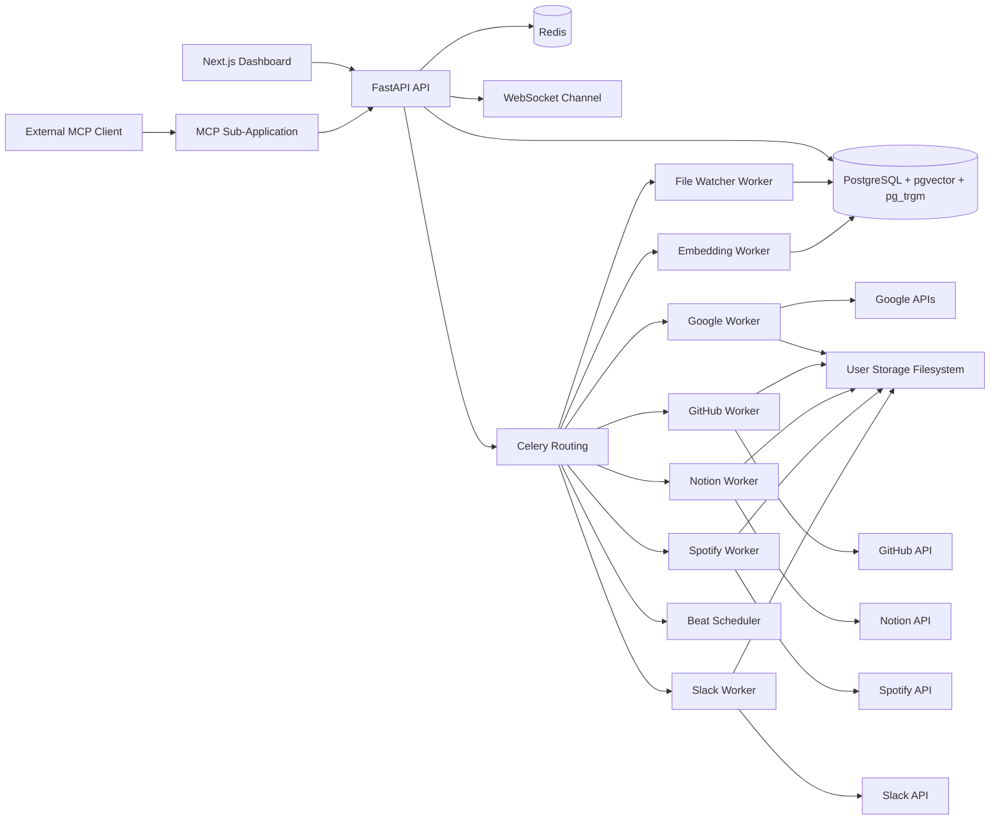

# PersonalAPI

PersonalAPI is a full-stack personal knowledge platform that connects external services (Google, GitHub, Notion, Spotify, Slack), normalizes incoming data, indexes it for retrieval, and serves grounded responses through REST APIs, chat, WebSocket notifications, and MCP tools.

## Collaborators

- anshjadhav
- nishantpatil
- pratik

## What This Project Solves

Personal data lives in many apps. PersonalAPI unifies those apps into one searchable and chat-ready knowledge layer.

Core capabilities:
- Multi-source connector ingestion (OAuth + token-based)
- Unified item model across services
- Queue-based sync and indexing pipelines
- Search and chat APIs with source citations
- Developer API key system
- MCP tool server for external AI clients

## Tech Stack

- Backend: FastAPI, SQLAlchemy, PostgreSQL (pgvector + pg_trgm), Redis, Celery
- Frontend: Next.js, React, TanStack Query, Axios
- Retrieval: chunking + embedding + hybrid retrieval + answer generation
- Messaging: WebSocket user-scoped sync notifications

## Architecture Snapshot



### Request and indexing flow

1. A user authenticates and connects an external service.
2. The backend stores connector metadata and provider tokens.
3. A sync task is routed into a platform-specific Celery queue.
4. A worker fetches source records, normalizes them, writes user files, and upserts items.
5. File watcher and embedding workers update retrieval-ready chunk data.
6. Search, chat, dashboard, and MCP clients consume indexed data.

## Repository Layout

```text
backend/
  api/
    core/         # settings, DB wiring, auth, security, OAuth helpers
    models/       # SQLAlchemy ORM models
    routers/      # auth, connectors, search, chat, developer, websocket
    schemas/      # Pydantic request/response contracts
    main.py       # FastAPI entrypoint and router mounting
  mcp/            # MCP-compatible FastAPI sub-application
  migrations/     # SQL bootstrap scripts
  normalizer/     # source-specific normalization logic
  rag/            # chunking, retrieval, context, generation, indexing
  scripts/        # operational utilities
  storage/        # user-scoped file storage
  tests/          # unit, integration, and live backend tests
  workers/        # Celery app, queue tasks, auto-sync, embeddings
frontend/
  app/            # Next.js app router pages
  components/     # UI components
  hooks/          # frontend state hooks and API integration hooks
  lib/            # API client and shared utilities
docs/             # system architecture, implementation notes, deployment docs
```

## Technology Stack

### Backend

- Python
- FastAPI
- SQLAlchemy
- Pydantic and pydantic-settings
- psycopg
- Redis
- Celery
- pgvector
- httpx

### Frontend

- Next.js 16
- React 19
- TanStack Query
- Axios
- TypeScript
- Tailwind CSS 4

### Data and retrieval

- PostgreSQL 16
- pgvector for embeddings
- pg_trgm for text similarity support
- Retrieval pipeline under `backend/rag`

## Runtime Components

### Backend HTTP application

The main application entrypoint is `backend/api/main.py` and exposes:

- `GET /health`
- `GET /health/llm`
- router groups for auth, emails, documents, search, connectors, developer APIs, chat, and WebSocket
- the MCP sub-application mounted at `/mcp`

Startup performs a database connectivity check and intentionally fails fast if the database is unreachable or the schema is unavailable.

### Celery queues

The worker layer defines these queues:

- `default`
- `connector.google`
- `connector.github`
- `connector.notion`
- `connector.spotify`
- `connector.slack`
- `pipeline.file-watcher`
- `pipeline.embedding`

Celery beat dispatches automatic sync work on a configured interval.

### MCP server

The MCP server lives in `backend/mcp/server.py` and supports developer-key-authenticated tool access. It can be mounted into the main app or run standalone.

Supported MCP tools:

- `search`
- `ask`
- `get_item`
- `list_connectors`
- `get_profile`

## Supported Integrations

The current backend code supports connector flows for these platforms:

- `gmail`
- `drive`
- `gcal`
- `github`
- `notion`
- `spotify`
- `slack`

Implementation notes:

- Google services share OAuth and connector management patterns.
- GitHub includes OAuth connection and webhook ownership matching logic.
- Spotify refresh-token handling is part of the sync pipeline.
- Notion supports both OAuth and token-based development flows.

## API Surface

### Health

- `GET /health`
- `GET /health/llm`
- `GET /mcp/health`

### Authentication

- `POST /auth/register`
- `POST /auth/login`
- `POST /auth/google`
- `GET /auth/google/connect`
- `GET /auth/google/callback`
- `GET /auth/me`

### Content APIs

- `GET /v1/emails/`
- `GET /v1/documents/`
- `GET /v1/search/`

### Connector APIs

Base prefix: `/v1/connectors`

Representative operations:

- list connectors
- fetch a connector by platform
- trigger sync
- bootstrap development connector state
- update auto-sync behavior
- disconnect a connector
- provider-specific connect and callback flows

### Chat APIs

- `POST /v1/chat/message`
- `GET /v1/chat/{session_id}/history`

Chat responses return:

- answer text
- grounded source entries
- related document identifiers
- file links

### Developer APIs

- `POST /v1/developer/api-keys`
- `GET /v1/developer/api-keys`
- `POST /v1/developer/api-keys/{api_key_id}/revoke`

### WebSocket

- `GET /ws?token=<jwt>`

Expected user-scoped events include connection, sync started, sync completed, and sync failed notifications.

## Data Model

Core persisted entities include:

- `users`
- `connectors`
- `items`
- `item_chunks`
- `chat_sessions`
- `chat_messages`
- `api_keys`
- `access_logs`

High-level storage behavior:

- PostgreSQL stores normalized items, relational metadata, connector state, chat history, and access-control data.
- `item_chunks` stores retrieval-ready chunk text plus vector embeddings.
- `backend/storage/users` stores user-owned source artifacts and snapshots.
- Redis acts as worker broker and result backend.

## Environment Configuration

The backend expects environment variables or a populated `.env` file. A template is provided in `backend/.env.example`.

### Core settings

- `APP_NAME`
- `APP_VERSION`
- `API_PREFIX`
- `DEBUG`
- `ENABLE_INLINE_SYNC_FALLBACK`
- `CORS_ORIGINS`
- `FRONTEND_APP_URL`
- `USER_DATA_ROOT`

### Database and cache

- `DATABASE_URL`
- `DATABASE_SSL_MODE`
- `DATABASE_CONNECT_TIMEOUT`
- `REDIS_URL`
- `AUTO_SYNC_ENABLED`

### Auth and security

- `SECRET_KEY`
- `ALGORITHM`
- `ACCESS_TOKEN_EXPIRE_MINUTES`

### Optional local LLM settings

- `RAG_LLM_ENABLED`
- `RAG_LLM_PROVIDER`
- `RAG_LLM_BASE_URL`
- `RAG_LLM_MODEL`
- `RAG_LLM_TIMEOUT_SECONDS`
- `RAG_LLM_TEMPERATURE`
- `RAG_LLM_MAX_TOKENS`

### Connector credentials

- `GOOGLE_CLIENT_ID`
- `GOOGLE_ALLOWED_CLIENT_IDS`
- `GOOGLE_CLIENT_SECRET`
- `GOOGLE_AUTH_REDIRECT_URI`
- `GOOGLE_REDIRECT_URI`
- `GOOGLE_TOKEN_INFO_URL`
- `SPOTIFY_CLIENT_ID`
- `SPOTIFY_CLIENT_SECRET`
- `SPOTIFY_REDIRECT_URI`
- `SLACK_CLIENT_ID`
- `SLACK_CLIENT_SECRET`
- `SLACK_REDIRECT_URI`
- `NOTION_CLIENT_ID`
- `NOTION_CLIENT_SECRET`
- `NOTION_REDIRECT_URI`

Production guidance:

- Replace the example `SECRET_KEY` immediately.
- Manage secrets outside source control.
- Use `DATABASE_SSL_MODE=require` for managed PostgreSQL.
- Restrict `CORS_ORIGINS` to approved frontend origins.

## Local Development

### Prerequisites

- Python 3.11 or newer
- Node.js 20 or newer
- PostgreSQL 16 with pgvector support, unless using Docker
- Redis 7 or newer
- Docker Desktop or Docker Engine for containerized workflows

### Backend setup

```bash
cd backend
python -m venv .venv
```

Windows PowerShell:

```powershell
cd backend
.\.venv\Scripts\Activate.ps1
pip install -r requirements.txt
```

Run the API locally:

```bash
cd backend
uvicorn api.main:app --reload --host 0.0.0.0 --port 8000
```

### Frontend setup

```bash
cd frontend
npm install
npm run dev
```

Default local endpoints:

- Frontend: `http://localhost:3000`
- Backend: `http://127.0.0.1:8000`
- Swagger UI: `http://127.0.0.1:8000/docs`
- MCP health: `http://127.0.0.1:8000/mcp/health`

### Local workers

Run each worker in a dedicated terminal when developing without the full Docker stack.

```bash
cd backend
celery -A workers.celery_app:celery_app worker --loglevel=INFO --queues=connector.google --hostname=worker-google@%h
```

```bash
cd backend
celery -A workers.celery_app:celery_app worker --loglevel=INFO --queues=connector.github --hostname=worker-github@%h
```

```bash
cd backend
celery -A workers.celery_app:celery_app worker --loglevel=INFO --queues=connector.notion --hostname=worker-notion@%h
```

```bash
cd backend
celery -A workers.celery_app:celery_app worker --loglevel=INFO --queues=connector.spotify --hostname=worker-spotify@%h
```

```bash
cd backend
celery -A workers.celery_app:celery_app worker --loglevel=INFO --queues=connector.slack --hostname=worker-slack@%h
```

```bash
cd backend
celery -A workers.celery_app:celery_app worker --loglevel=INFO --queues=pipeline.file-watcher --hostname=worker-file-watcher@%h
```

```bash
cd backend
celery -A workers.celery_app:celery_app worker --loglevel=INFO --queues=pipeline.embedding --hostname=worker-embedding@%h
```

Run the scheduler:

```bash
cd backend
celery -A workers.celery_app:celery_app beat --loglevel=INFO
```

### Database bootstrap

If you are not using the containerized database, create the database and apply the SQL migrations manually.

```bash
cd backend
psql -U postgres -h localhost -d personalapi -f migrations/001_initial.sql
psql -U postgres -h localhost -d personalapi -f migrations/002_item_chunks.sql
```

## Docker Deployment

The repository includes a backend Docker workflow in `backend/docker-compose.yml`.

### Services started by compose

- `db`
- `redis`
- `api`
- `worker-google`
- `worker-github`
- `worker-notion`
- `worker-spotify`
- `worker-slack`
- `worker-file-watcher`
- `worker-embedding`
- `worker-beat`

### Start the backend stack

```bash
cd backend
docker compose up --build
```

### Hybrid mode

Use Docker only for infrastructure while running Python processes locally:

```bash
cd backend
docker compose up -d db redis
```

### Standalone MCP mode

```bash
cd backend
uvicorn mcp.server:app --host 0.0.0.0 --port 8001 --reload
```

## Testing and Verification

### Backend tests

```bash
cd backend
py -3 -m pytest tests/ -q
```

### Live backend smoke tests

The repository includes hosted-backend smoke tests that default to `https://api.personalapi.tech` unless `BASE_URL` is overridden.

```bash
cd backend
python -m pytest tests/test_live_backend.py -v -s
```

### Frontend quality checks

```bash
cd frontend
npm run lint
npm run build
```

Recommended pre-merge validation:

1. Run backend tests.
2. Run frontend lint and production build.
3. Verify configured connector auth URLs.
4. Verify `GET /health`, `GET /health/llm`, and `GET /mcp/health`.

## Operational Notes

### Security model

- JWT-based user authentication is used for dashboard and API access.
- Developer API keys are stored as SHA-256 hashes, not raw secrets.
- User data access is guarded by authenticated user ownership checks.
- The backend intentionally blocks startup on database connectivity failures.

### Sync model

- Sync work is routed to per-platform queues.
- Automatic sync dispatch is handled by Celery beat.
- Failed worker jobs are pushed into a Redis-backed dead-letter queue pattern.
- Connector tokens and cursors are updated during sync cycles.

### Storage model

- Relational metadata and retrieval state live in PostgreSQL.
- Redis is required for worker execution.
- User-owned source artifacts are written under `backend/storage/users`.

## Production Readiness Checklist

- Replace all placeholder secrets and OAuth credentials.
- Ensure PostgreSQL has `pgvector` and `pg_trgm` available before bootstrapping.
- Run migrations before exposing the API to traffic.
- Put the backend behind TLS termination.
- Restrict CORS to approved frontend origins.
- Run dedicated worker processes for every required queue.
- Monitor API health, worker failures, Redis availability, and database latency.
- Protect provider callback URLs and webhook secrets with production values.
- Back up PostgreSQL and persisted user-storage volumes.
- Verify API key rotation and revocation paths.

## Troubleshooting

### API fails during startup

Common causes:

- invalid `DATABASE_URL`
- unreachable PostgreSQL host
- missing schema or missing extensions

Check database connectivity, migration status, and `DATABASE_SSL_MODE`.

### Connector OAuth endpoints return `503`

This usually means the relevant provider credentials are not configured in the environment.

### Search or chat returns empty results

Check whether:

- a connector sync actually ran
- normalized items were inserted
- the embedding pipeline processed chunks
- retrieval tables contain data for the current user

### WebSocket events are missing

Check:

- worker completion paths
- the authenticated WebSocket token
- Redis availability

## Documentation

Additional project documentation is available in:

- `docs/01-system-architecture.md`
- `docs/02-implementation-guide.md`
- `docs/03-deployment-and-scaling.md`
- `docs/backend-implementation-log.md`
- `docs/FRONTEND_API_REFERENCE.md`
- `frontend/docs/API_INTEGRATION.md`
- `frontend/docs/DASHBOARD_DESIGN.md`
- `frontend/docs/LANDING_PAGE.md`

## Contributors

Contributor details below are consolidated from repository history and project ownership.

- Om Sakhare: https://github.com/Arch-777
- Ansh Jadhav: https://github.com/JadhavAnsh
- Nishant Patil: https://github.com/const-nishant
- Pratik Dandge: https://github.com/Insomniac-Coder0
