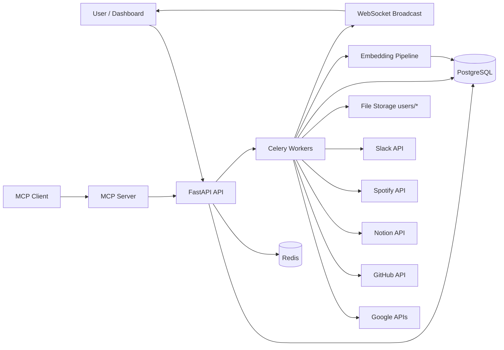
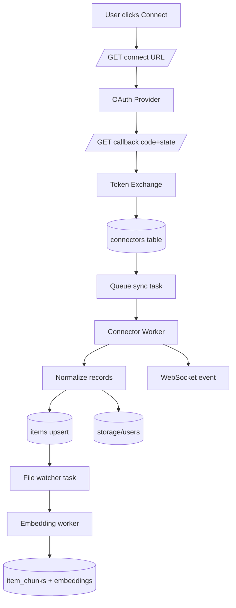
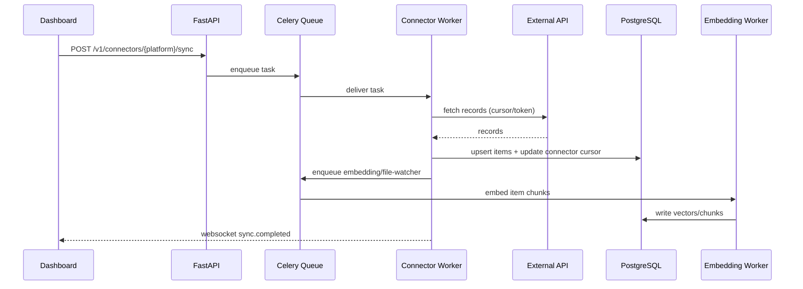
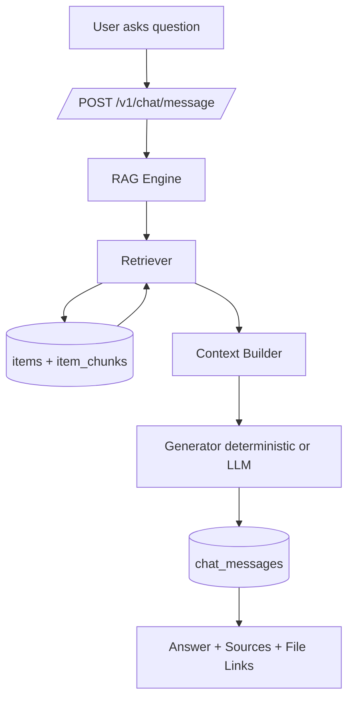
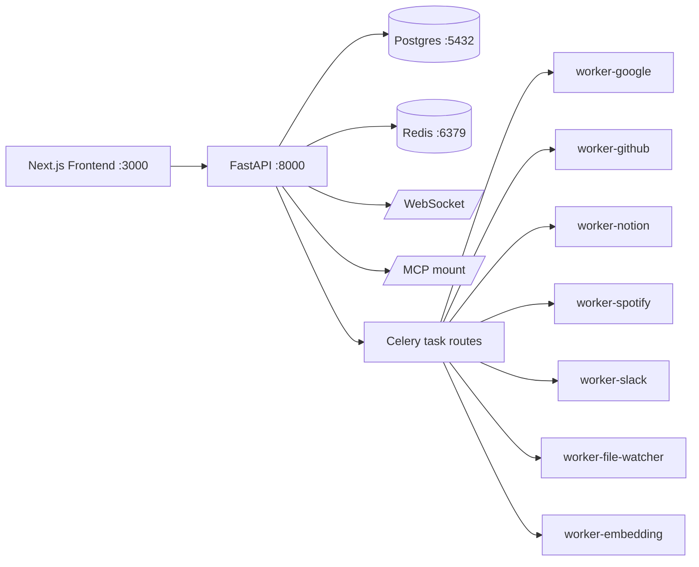

# PersonalAPI

PersonalAPI is a full-stack personal knowledge platform that connects external services (Google, GitHub, Notion, Spotify, Slack), normalizes incoming data, indexes it for retrieval, and serves grounded responses through REST APIs, chat, WebSocket notifications, and MCP tools.

## Collaborators

- anshjadhav
- nishantpatil
- partik

## What This Project Solves

Personal data lives in many apps. PersonalAPI unifies those apps into one searchable and chat-ready knowledge layer.

Core capabilities:
- Multi-source connector ingestion (OAuth + token-based)
- Unified item model across services
- Queue-based sync and indexing pipelines
- Search and chat APIs with source citations
- Developer API key system
- MCP tool server for external AI clients

## Tech Stack

- Backend: FastAPI, SQLAlchemy, PostgreSQL (pgvector + pg_trgm), Redis, Celery
- Frontend: Next.js, React, TanStack Query, Axios
- Retrieval: chunking + embedding + hybrid retrieval + answer generation
- Messaging: WebSocket user-scoped sync notifications

## Architecture Snapshot



## Project Structure

```text
backend/
	api/
		main.py
		core/
		models/
		routers/
		schemas/
	workers/
		celery_app.py
		connector_sync.py
		*_worker.py
	normalizer/
	rag/
	mcp/
		server.py
	migrations/
	tests/
frontend/
	app/
	components/
	hooks/
	lib/
docs/
```

## Detailed Working

### 1) Authentication and Identity

Auth router paths:
- /auth/register
- /auth/login
- /auth/google/connect
- /auth/google/callback
- /auth/google
- /auth/me

How it works:
1. User signs in with local credentials or Google OAuth.
2. Backend issues JWT access token.
3. Protected routes resolve user from token and enforce user-scoped data access.

### 2) Connector Lifecycle

Base path: /v1/connectors

Connector operations:
- List connectors
- Get connector details by platform
- Start sync
- OAuth connect/callback per platform
- Bootstrap connector entries for controlled flows
- GitHub webhook ingestion endpoint

Lifecycle:
1. Generate provider auth URL with signed state.
2. Receive callback code + state.
3. Exchange code for token.
4. Upsert connector metadata and token data.
5. Enqueue sync task.

### 3) Sync and Worker Pipeline

Queues:
- connector.google
- connector.github
- connector.notion
- connector.spotify
- connector.slack
- pipeline.file-watcher
- pipeline.embedding

Worker logic:
1. Validate connector ownership + platform.
2. Refresh expired OAuth tokens if needed.
3. Fetch records from provider APIs with cursor state.
4. Normalize records to internal schema.
5. Persist source files and upsert database items.
6. Trigger chunk indexing and embeddings.
7. Save sync_cursor and last_synced timestamps.
8. Broadcast sync.started / sync.completed / sync.failed events.

### 4) Storage and Indexing

Main entities:
- users
- connectors
- items
- item_chunks
- chat_sessions
- chat_messages
- api_keys
- access_logs

Storage behavior:
- PostgreSQL stores normalized content and metadata.
- item_chunks stores chunk text + embeddings.
- backend/storage/users holds user file snapshots by source.
- Redis is used by Celery for broker/result and signaling.

### 5) Search and Chat

Search endpoint: GET /v1/search

Search behavior:
- User-scoped filtering
- Full-text and similarity based ranking
- Optional type filtering and debug scoring

Chat endpoints:
- POST /v1/chat/message
- GET /v1/chat/{session_id}/history

Chat behavior:
1. Save user message to session history.
2. Retrieve relevant chunks/items.
3. Build context and generate answer.
4. Persist assistant response with sources.
5. Return answer, sources, documents, links.

### 6) Real-Time Notifications

WebSocket path: /ws?token=<jwt>

Realtime events:
- connected
- sync.started
- sync.completed
- sync.failed

The dashboard can react to sync progress without polling.

### 7) MCP Tool Layer

Mounted path: /mcp

Auth model:
- API key passed in X-API-Key
- Keys are issued and revoked via /v1/developer/api-keys
- Backend stores only SHA-256 hashes of keys

Tool operations:
- search
- ask
- get_item
- list_connectors
- get_profile

## Data Flow and Flow Charts

### A) Connector Ingestion Data Flow



### B) Sync Sequence Flow



### C) Chat and Retrieval Flow



### D) Runtime Services Flow



## Installation and Running Commands

### Prerequisites

- Python 3.11+ (Docker image uses Python 3.12)
- Node.js 20+
- PostgreSQL 16+ with pgvector extension (or use Docker service)
- Redis 7+
- Docker Desktop (recommended)

### 1) Fastest Setup (Docker for backend)

```bash
cd backend
docker compose up --build
```

Starts:
- db
- redis
- api
- worker-google
- worker-github
- worker-notion
- worker-spotify
- worker-slack
- worker-file-watcher
- worker-embedding

### 2) Frontend Setup

```bash
cd frontend
npm install
npm run dev
```

Frontend default URL: http://localhost:3000

### 3) Hybrid Setup (infra in Docker, app local)

Use this if you want local debugging with externalized DB/Redis.

```bash
cd backend
docker compose up -d db redis
```

Then run backend API locally:

```bash
cd backend
python -m venv .venv
# Windows PowerShell
.\.venv\Scripts\Activate.ps1
pip install -r requirements.txt
uvicorn api.main:app --reload --host 0.0.0.0 --port 8000
```

Run workers in separate terminals:

```bash
cd backend
celery -A workers.celery_app:celery_app worker --loglevel=INFO --queues=connector.google --hostname=worker-google@%h
```

```bash
cd backend
celery -A workers.celery_app:celery_app worker --loglevel=INFO --queues=connector.github --hostname=worker-github@%h
```

```bash
cd backend
celery -A workers.celery_app:celery_app worker --loglevel=INFO --queues=connector.notion --hostname=worker-notion@%h
```

```bash
cd backend
celery -A workers.celery_app:celery_app worker --loglevel=INFO --queues=connector.spotify --hostname=worker-spotify@%h
```

```bash
cd backend
celery -A workers.celery_app:celery_app worker --loglevel=INFO --queues=connector.slack --hostname=worker-slack@%h
```

```bash
cd backend
celery -A workers.celery_app:celery_app worker --loglevel=INFO --queues=pipeline.file-watcher --hostname=worker-file-watcher@%h
```

```bash
cd backend
celery -A workers.celery_app:celery_app worker --loglevel=INFO --queues=pipeline.embedding --hostname=worker-embedding@%h
```

### 4) Fully Local DB Initialization (if not using Docker DB)

Create database and run migrations SQL:

```bash
cd backend
psql -U postgres -h localhost -d personalapi -f migrations/001_initial.sql
psql -U postgres -h localhost -d personalapi -f migrations/002_item_chunks.sql
```

### 5) MCP Server Standalone (optional)

```bash
cd backend
uvicorn mcp.server:app --host 0.0.0.0 --port 8001 --reload
```

Note: main API also mounts MCP at /mcp when available.

## Environment Variables (Backend)

Configured by backend/api/core/config.py (load order supports .env):
- app_name, app_version, api_prefix, debug
- database_url, redis_url
- secret_key, access_token_expire_minutes, algorithm
- cors_origins, frontend_app_url
- google_client_id, google_client_secret, google_redirect_uri
- github_client_id, github_client_secret, github_redirect_uri, github_webhook_secret
- notion_client_id, notion_client_secret, notion_redirect_uri
- spotify_client_id, spotify_client_secret, spotify_redirect_uri
- slack_client_id, slack_client_secret, slack_redirect_uri
- rag_llm_enabled, rag_llm_provider, rag_llm_base_url, rag_llm_model

## Running Commands Cheat Sheet

Backend API:

```bash
cd backend
uvicorn api.main:app --reload --host 0.0.0.0 --port 8000
```

Run tests:

```bash
cd backend
pytest
```

Run only GitHub-related tests:

```bash
cd backend
pytest tests/test_api.py -k "github"
```

Frontend:

```bash
cd frontend
npm run dev
```

## Health and Verification

Backend health:

```bash
curl http://127.0.0.1:8000/health
```

LLM health:

```bash
curl http://127.0.0.1:8000/health/llm
```

Swagger docs:

```text
http://127.0.0.1:8000/docs
```

## API Quick Reference

- GET /health
- GET /health/llm
- /auth/*
- /v1/emails
- /v1/documents
- /v1/search
- /v1/chat/*
- /v1/connectors/*
- /v1/developer/api-keys*
- /ws
- /mcp/*

## Frontend Working Summary

The frontend uses an Axios client with bearer-token injection and React Query for server-state synchronization.

Runtime behavior:
1. User token is loaded from browser storage.
2. API calls go through frontend/lib/api-client.ts.
3. Connectors are fetched and mutated through hooks in frontend/hooks.
4. Query invalidation refreshes connector state after sync actions.
5. UI can consume websocket events for realtime sync status updates.

## Operational Notes

- Sync is intentionally asynchronous: API enqueues, workers process.
- Data isolation is enforced by user_id checks at query time.
- API keys are only shown once at creation, then stored as hashes.
- Retrieval responses include sources for traceability.
- Queue failures are retried and can be pushed to dead-letter keys in Redis.

## Additional Documentation

- docs/01-system-architecture.md
- docs/02-implementation-guide.md
- docs/03-deployment-and-scaling.md
- docs/FRONTEND_API_REFERENCE.md
- docs/postman/PersonalAPI.postman_collection.json
