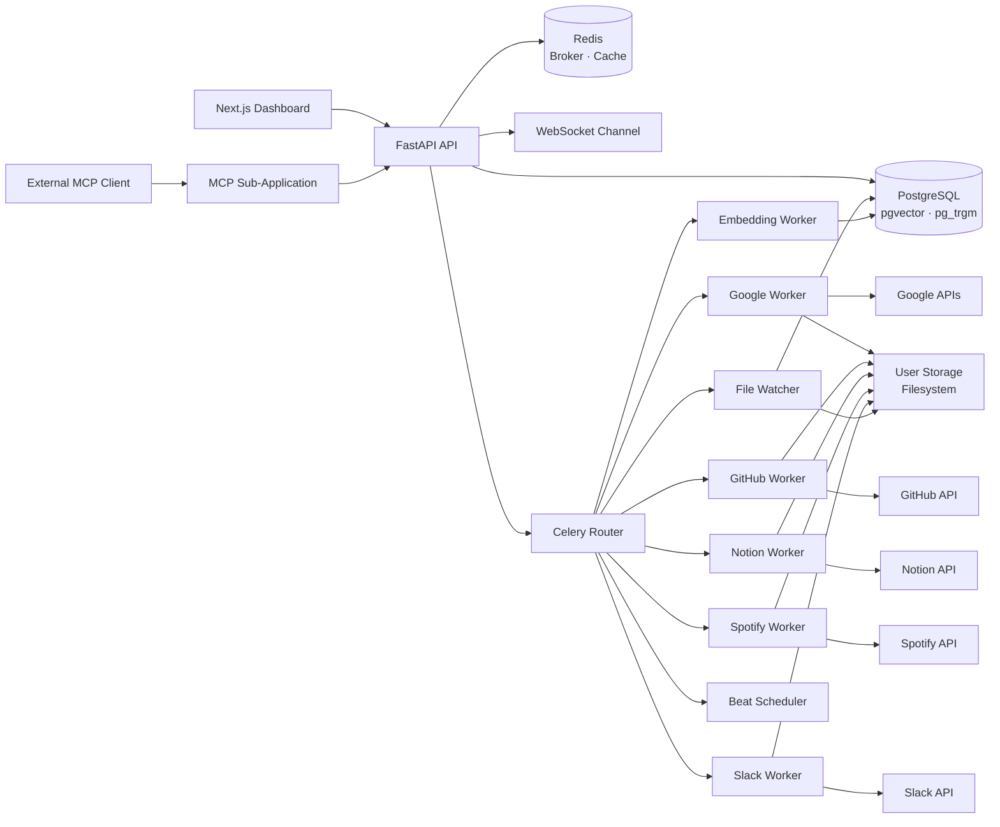

<div align="center">


# PersonalAPI

**Your personal knowledge layer — one API for everything you've ever touched.**

Connect Gmail, Drive, Calendar, GitHub, Notion, Spotify, and Slack into a single searchable, chat-ready platform with real-time sync, vector search, and MCP tool support.

[](https://fastapi.tiangolo.com)
[](https://nextjs.org)
[](https://www.postgresql.org)
[](https://redis.io)
[](https://docs.celeryq.dev)
[](https://python.org)
[](https://www.typescriptlang.org)
[](LICENSE)

[Live Demo](https://personalapi.tech) · [API Docs](https://api.personalapi.tech/docs) · [MCP Health](https://api.personalapi.tech/mcp/health) · [Report Bug](https://github.com/const-nishant/personalapi/issues)

---

</div>

## Table of Contents

- [Overview](#overview)
- [Architecture](#architecture)
- [Features](#features)
- [Tech Stack](#tech-stack)
- [Getting Started](#getting-started)
  - [Prerequisites](#prerequisites)
  - [Local Development](#local-development)
  - [Docker Deployment](#docker-deployment)
- [Configuration](#configuration)
- [API Reference](#api-reference)
- [Data Model](#data-model)
- [Workers & Queues](#workers--queues)
- [Testing](#testing)
- [Production Checklist](#production-checklist)
- [Troubleshooting](#troubleshooting)
- [Contributing](#contributing)
- [Team](#team)

---

## Overview

Personal data is fragmented across dozens of apps. PersonalAPI solves this by providing a **unified ingestion, indexing, and retrieval layer** over your connected services — exposing it all through clean REST APIs, a chat interface, real-time WebSocket notifications, and an MCP tool server for AI clients like Claude.

```
You ask: "What did I discuss with Ansh last Tuesday?"
PersonalAPI: searches Gmail + Slack + Calendar → returns a grounded answer with citations
```

### What It Does

| Capability | Description |
|---|---|
| **Multi-source ingestion** | OAuth + token-based connectors for 7 platforms |
| **Unified item model** | Normalized schema across all sources |
| **Hybrid retrieval** | pgvector (semantic) + pg_trgm (lexical) search |
| **Chat with citations** | RAG-powered responses grounded in your data |
| **Real-time sync** | Queue-based workers with WebSocket push notifications |
| **Developer APIs** | API key management for programmatic access |
| **MCP server** | First-class tool server for external AI clients |

---

## Architecture



### Request & Indexing Flow

```
1. User authenticates → connects external service via OAuth / token
2. Backend stores connector metadata + provider credentials
3. Sync task is dispatched to platform-specific Celery queue
4. Worker fetches records → normalizes → writes user files → upserts items
5. File Watcher + Embedding workers chunk text and generate vector embeddings
6. Search, Chat, Dashboard, and MCP clients query the indexed data
```

---

## Features

<details>
<summary><strong>🔌 Connectors</strong></summary>

| Platform | Auth | Notes |
|---|---|---|
| Gmail | OAuth 2.0 | Full email ingestion |
| Google Drive | OAuth 2.0 | Document sync |
| Google Calendar | OAuth 2.0 | Events and scheduling |
| GitHub | OAuth 2.0 | Repos, issues, PRs with webhook matching |
| Notion | OAuth + token | Pages and databases |
| Spotify | OAuth 2.0 | Listening history with refresh-token handling |
| Slack | OAuth 2.0 | Messages and channels |

</details>

<details>
<summary><strong>🔍 Search & Retrieval</strong></summary>

- **Hybrid search** — pgvector for semantic similarity + pg_trgm for fuzzy text matching
- **Chunked indexing** — documents split into retrieval-ready chunks with embeddings
- **Source citations** — every answer includes traceable source references
- **Related documents** — surfaced alongside chat responses

</details>

<details>
<summary><strong>💬 Chat</strong></summary>

- Session-based multi-turn conversations
- Grounded answers with source entries and file links
- Configurable LLM backend (local or remote via `RAG_LLM_*` settings)

</details>

<details>
<summary><strong>⚡ Real-time</strong></summary>

- JWT-authenticated WebSocket channel per user
- Events: `connection`, `sync_started`, `sync_completed`, `sync_failed`

</details>

<details>
<summary><strong>🛠 MCP Server</strong></summary>

Mountable as a sub-app or run standalone on port `8001`. Developer-key authenticated.

| Tool | Description |
|---|---|
| `search` | Semantic + lexical search over indexed items |
| `ask` | RAG-powered question answering |
| `get_item` | Fetch a specific item by ID |
| `list_connectors` | List connected services for a user |
| `get_profile` | Retrieve user profile information |

</details>

---

## Tech Stack

### Backend
| Layer | Technology |
|---|---|
| Framework | FastAPI, Pydantic v2 |
| ORM | SQLAlchemy + psycopg |
| Task queue | Celery + Redis |
| Vector search | pgvector |
| Text search | pg_trgm |
| HTTP client | httpx |

### Frontend
| Layer | Technology |
|---|---|
| Framework | Next.js 16 (App Router) |
| UI | React 19, Tailwind CSS 4 |
| State | TanStack Query |
| HTTP | Axios |
| Language | TypeScript |

### Infrastructure
| Component | Technology |
|---|---|
| Database | PostgreSQL 16 |
| Cache / Broker | Redis 7 |
| Containerization | Docker + Compose |

---

## Getting Started

### Prerequisites

| Tool | Minimum Version |
|---|---|
| Python | 3.11 |
| Node.js | 20 |
| PostgreSQL | 16 (with `pgvector` + `pg_trgm`) |
| Redis | 7 |
| Docker Desktop | Latest (optional, recommended) |

---

### Local Development

#### 1. Clone the repository

```bash
git clone https://github.com/const-nishant/personalapi.git
cd personalapi
```

#### 2. Backend setup

```bash
cd backend
python -m venv .venv

# macOS / Linux
source .venv/bin/activate

# Windows PowerShell
.\.venv\Scripts\Activate.ps1

pip install -r requirements.txt
```

Copy and populate the environment file:

```bash
cp .env.example .env
# Edit .env with your credentials — see Configuration section
```

Run database migrations:

```bash
psql -U postgres -h localhost -d personalapi -f migrations/001_initial.sql
psql -U postgres -h localhost -d personalapi -f migrations/002_item_chunks.sql
```

Start the API:

```bash
uvicorn api.main:app --reload --host 0.0.0.0 --port 8000
```

#### 3. Frontend setup

```bash
cd frontend
npm install
npm run dev
```

#### 4. Start workers (each in a separate terminal)

```bash
# Google connector
celery -A workers.celery_app:celery_app worker --loglevel=INFO \
  --queues=connector.google --hostname=worker-google@%h

# GitHub connector
celery -A workers.celery_app:celery_app worker --loglevel=INFO \
  --queues=connector.github --hostname=worker-github@%h

# Notion connector
celery -A workers.celery_app:celery_app worker --loglevel=INFO \
  --queues=connector.notion --hostname=worker-notion@%h

# Spotify connector
celery -A workers.celery_app:celery_app worker --loglevel=INFO \
  --queues=connector.spotify --hostname=worker-spotify@%h

# Slack connector
celery -A workers.celery_app:celery_app worker --loglevel=INFO \
  --queues=connector.slack --hostname=worker-slack@%h

# File watcher pipeline
celery -A workers.celery_app:celery_app worker --loglevel=INFO \
  --queues=pipeline.file-watcher --hostname=worker-file-watcher@%h

# Embedding pipeline
celery -A workers.celery_app:celery_app worker --loglevel=INFO \
  --queues=pipeline.embedding --hostname=worker-embedding@%h

# Beat scheduler (auto-sync)
celery -A workers.celery_app:celery_app beat --loglevel=INFO
```

#### 5. Verify

| Endpoint | Expected |
|---|---|
| `http://localhost:3000` | Frontend dashboard |
| `http://127.0.0.1:8000/health` | `{"status": "ok"}` |
| `http://127.0.0.1:8000/health/llm` | LLM backend status |
| `http://127.0.0.1:8000/docs` | Swagger UI |
| `http://127.0.0.1:8000/mcp/health` | MCP server status |

---

### Docker Deployment

The full backend stack (API + all workers + DB + Redis) is orchestrated via Compose.

```bash
cd backend
docker compose up --build
```

**Services started:**

`db` · `redis` · `api` · `worker-google` · `worker-github` · `worker-notion` · `worker-spotify` · `worker-slack` · `worker-file-watcher` · `worker-embedding` · `worker-beat`

**Hybrid mode** — Docker for infrastructure only, Python processes run locally:

```bash
cd backend
docker compose up -d db redis
```

**Standalone MCP server:**

```bash
uvicorn mcp.server:app --host 0.0.0.0 --port 8001 --reload
```

---

## Configuration

All configuration is managed via environment variables or a `.env` file. A template is provided at `backend/.env.example`.

### Core Application

| Variable | Description | Default |
|---|---|---|
| `APP_NAME` | Application name | `PersonalAPI` |
| `APP_VERSION` | API version string | — |
| `API_PREFIX` | Route prefix | `/v1` |
| `DEBUG` | Enable debug mode | `false` |
| `CORS_ORIGINS` | Allowed frontend origins (comma-separated) | — |
| `FRONTEND_APP_URL` | Frontend base URL | — |
| `USER_DATA_ROOT` | Root path for user file storage | — |
| `ENABLE_INLINE_SYNC_FALLBACK` | Fallback sync mode flag | `false` |

### Database & Cache

| Variable | Description |
|---|---|
| `DATABASE_URL` | PostgreSQL connection string |
| `DATABASE_SSL_MODE` | `disable` / `require` (use `require` in production) |
| `DATABASE_CONNECT_TIMEOUT` | Connection timeout in seconds |
| `REDIS_URL` | Redis connection string |
| `AUTO_SYNC_ENABLED` | Enable Celery beat auto-sync |

### Auth & Security

| Variable | Description |
|---|---|
| `SECRET_KEY` | JWT signing secret — **replace immediately** |
| `ALGORITHM` | JWT algorithm (`HS256`) |
| `ACCESS_TOKEN_EXPIRE_MINUTES` | Token TTL |

### LLM / RAG (Optional)

| Variable | Description |
|---|---|
| `RAG_LLM_ENABLED` | Enable LLM-powered chat responses |
| `RAG_LLM_PROVIDER` | LLM provider identifier |
| `RAG_LLM_BASE_URL` | Provider base URL |
| `RAG_LLM_MODEL` | Model name |
| `RAG_LLM_TIMEOUT_SECONDS` | Request timeout |
| `RAG_LLM_TEMPERATURE` | Sampling temperature |
| `RAG_LLM_MAX_TOKENS` | Max tokens per response |

### Connector Credentials

<details>
<summary>Google</summary>

| Variable | Description |
|---|---|
| `GOOGLE_CLIENT_ID` | OAuth 2.0 client ID |
| `GOOGLE_CLIENT_SECRET` | OAuth 2.0 client secret |
| `GOOGLE_ALLOWED_CLIENT_IDS` | Comma-separated allowed client IDs |
| `GOOGLE_AUTH_REDIRECT_URI` | Auth redirect URI |
| `GOOGLE_REDIRECT_URI` | Token exchange redirect URI |
| `GOOGLE_TOKEN_INFO_URL` | Token introspection URL |

</details>

<details>
<summary>Spotify, Slack, Notion</summary>

Each follows the same `{PROVIDER}_CLIENT_ID`, `{PROVIDER}_CLIENT_SECRET`, `{PROVIDER}_REDIRECT_URI` pattern.

</details>

---

## API Reference

Full interactive docs available at `/docs` (Swagger) and `/redoc`.

### Health

```
GET  /health
GET  /health/llm
GET  /mcp/health
GET  /mcp/manifest
```

### MCP (JSON-RPC)

PersonalAPI now exposes a JSON-RPC MCP-compatible endpoint for external AI clients.

```text
POST /mcp/rpc
POST /mcp/        # root alias
```

Auth header (either one):

```text
X-API-Key: pk_live_...
Authorization: Bearer pk_live_...
```

Supported MCP methods:

```text
initialize
ping
tools/list
tools/call
```

SSE transport (for stream-oriented MCP clients):

```text
GET  /mcp/sse
POST /mcp/message?session_id=<session_id>
POST /mcp/sse/message?session_id=<session_id>
```

SSE flow:

1. Open `GET /mcp/sse` and read the first `endpoint` event.
2. Extract `session_id` from the event payload.
3. Send JSON-RPC payloads to `/mcp/message?session_id=<session_id>`.
4. Read `message` events on the SSE stream for JSON-RPC responses.

Example: list tools

```bash
curl -X POST http://127.0.0.1:8000/mcp/rpc \
  -H "Content-Type: application/json" \
  -d '{"jsonrpc":"2.0","id":1,"method":"tools/list","params":{}}'
```

Example: call search tool

```bash
curl -X POST http://127.0.0.1:8000/mcp/rpc \
  -H "Content-Type: application/json" \
  -H "Authorization: Bearer pk_live_your_key" \
  -d '{"jsonrpc":"2.0","id":2,"method":"tools/call","params":{"name":"search","arguments":{"query":"project roadmap","top_k":5}}}'
```

### Authentication

```
POST /auth/register
POST /auth/login
POST /auth/google
GET  /auth/google/connect
GET  /auth/google/callback
GET  /auth/me
```

### Content

```
GET  /v1/emails/
GET  /v1/documents/
GET  /v1/search/
```

### Connectors (`/v1/connectors`)

| Action | Method | Description |
|---|---|---|
| List connectors | `GET /` | All connectors for the current user |
| Get by platform | `GET /{platform}` | Single connector details |
| Trigger sync | `POST /{platform}/sync` | Enqueue a sync job |
| Update auto-sync | `PATCH /{platform}` | Toggle auto-sync on/off |
| Disconnect | `DELETE /{platform}` | Remove connector + credentials |
| Connect | `GET /{platform}/connect` | Initiate OAuth flow |
| OAuth callback | `GET /{platform}/callback` | Handle provider callback |

### Chat

```
POST /v1/chat/message
GET  /v1/chat/{session_id}/history
```

**Chat response shape:**
```json
{
  "answer": "string",
  "sources": [...],
  "related_document_ids": [...],
  "file_links": [...]
}
```

### Developer API Keys

```
POST /v1/developer/api-keys
GET  /v1/developer/api-keys
POST /v1/developer/api-keys/{api_key_id}/revoke
```

### WebSocket

```
GET  /ws?token=<jwt>
```

**Events:** `connection` · `sync_started` · `sync_completed` · `sync_failed`

---

## Data Model

```
users
  └── connectors          # per-platform OAuth state + cursor
  └── items               # normalized records from all sources
       └── item_chunks    # text chunks + vector embeddings
  └── chat_sessions
       └── chat_messages
  └── api_keys            # SHA-256 hashed developer keys
  └── access_logs
```

| Store | Contents |
|---|---|
| **PostgreSQL** | Normalized items, connector state, chat history, embeddings, access control |
| **Redis** | Celery broker, result backend, dead-letter queue |
| **Filesystem** (`backend/storage/users`) | User-owned source artifacts and snapshots |

---

## Workers & Queues

| Queue | Worker | Responsibility |
|---|---|---|
| `connector.google` | `worker-google` | Gmail, Drive, Calendar ingestion |
| `connector.github` | `worker-github` | GitHub repos, issues, PRs |
| `connector.notion` | `worker-notion` | Notion pages and databases |
| `connector.spotify` | `worker-spotify` | Spotify listening history |
| `connector.slack` | `worker-slack` | Slack messages and channels |
| `pipeline.file-watcher` | `worker-file-watcher` | Detect new/changed user files → DB |
| `pipeline.embedding` | `worker-embedding` | Chunk text → generate embeddings |
| `default` | (shared) | Misc tasks |

The **Celery Beat** scheduler dispatches auto-sync tasks on a configured interval across all connector queues.

Failed jobs follow a Redis-backed dead-letter pattern — inspect with `celery inspect reserved` or your monitoring tool of choice.

---

## Repository Layout

```
personalapi/
├── backend/
│   ├── api/
│   │   ├── core/         # Settings, DB wiring, auth, OAuth helpers
│   │   ├── models/       # SQLAlchemy ORM models
│   │   ├── routers/      # auth, connectors, search, chat, developer, ws
│   │   ├── schemas/      # Pydantic request / response contracts
│   │   └── main.py       # FastAPI entrypoint and router mounting
│   ├── mcp/              # MCP-compatible FastAPI sub-application
│   ├── migrations/       # SQL bootstrap scripts
│   ├── normalizer/       # Source-specific normalization logic
│   ├── rag/              # Chunking, retrieval, context, generation
│   ├── scripts/          # Operational utilities
│   ├── storage/          # User-scoped file storage
│   ├── tests/            # Unit, integration, live backend tests
│   └── workers/          # Celery app, queue tasks, beat, embeddings
├── frontend/
│   ├── app/              # Next.js App Router pages
│   ├── components/       # UI components
│   ├── hooks/            # State and API integration hooks
│   └── lib/              # API client and shared utilities
└── docs/
    ├── 01-system-architecture.md
    ├── 02-implementation-guide.md
    ├── 03-deployment-and-scaling.md
    ├── backend-implementation-log.md
    ├── FRONTEND_API_REFERENCE.md
    └── frontend/
        ├── API_INTEGRATION.md
        ├── DASHBOARD_DESIGN.md
        └── LANDING_PAGE.md
```

---

## Testing

### Backend unit + integration tests

```bash
cd backend
py -3 -m pytest tests/ -q
```

### Live smoke tests (against hosted backend)

Defaults to `https://api.personalapi.tech`. Override with `BASE_URL`:

```bash
BASE_URL=http://localhost:8000 python -m pytest tests/test_live_backend.py -v -s
```

### Frontend quality checks

```bash
cd frontend
npm run lint
npm run build
```

### Pre-merge validation checklist

- [ ] Backend tests pass
- [ ] Frontend lint + production build succeed
- [ ] `GET /health`, `GET /health/llm`, `GET /mcp/health` return OK
- [ ] Connector OAuth redirect URIs are correctly configured for the target environment

---

## Production Checklist

### Security

- [ ] Rotate `SECRET_KEY` to a cryptographically random value
- [ ] Set `DATABASE_SSL_MODE=require` for managed PostgreSQL
- [ ] Restrict `CORS_ORIGINS` to approved frontend domains only
- [ ] Store all secrets outside source control (use a secrets manager)
- [ ] Enable TLS termination in front of the API (nginx / load balancer)
- [ ] Protect provider OAuth callback URLs with production credentials

### Infrastructure

- [ ] Verify `pgvector` and `pg_trgm` extensions exist before running migrations
- [ ] Run all SQL migrations before first traffic
- [ ] Run a dedicated worker process per Celery queue
- [ ] Ensure Redis is persistent (`appendonly yes`) or acceptable to lose on restart

### Operations

- [ ] Set up health check monitoring on `/health`, `/health/llm`, `/mcp/health`
- [ ] Monitor worker failures and dead-letter queue depth
- [ ] Alert on Redis unavailability and high database latency
- [ ] Configure daily PostgreSQL backups and snapshot user-storage volumes
- [ ] Verify API key rotation and revocation paths are functional

---

## Troubleshooting

### API fails to start

```
Database connection failed
```

**Fix:** Check `DATABASE_URL`, confirm PostgreSQL is reachable, verify migrations have run, confirm `pgvector` and `pg_trgm` extensions exist. Check `DATABASE_SSL_MODE`.

---

### Connector OAuth returns `503`

**Fix:** The relevant provider credentials (`CLIENT_ID`, `CLIENT_SECRET`, `REDIRECT_URI`) are missing from the environment. Populate them and restart the API.

---

### Search / chat returns empty results

Work through this checklist in order:

1. Did the connector sync actually run? Check Celery worker logs.
2. Were items normalized and inserted? Query `SELECT COUNT(*) FROM items WHERE user_id = ?`.
3. Did the embedding worker process the chunks? Check `item_chunks` table.
4. Is `RAG_LLM_ENABLED=true` and is the LLM backend reachable (`GET /health/llm`)?

---

### WebSocket events are missing

**Fix:** Confirm Redis is running, the WebSocket token is valid (not expired), and worker completion paths are publishing events correctly.

---

### Workers not processing tasks

**Fix:** Verify the worker hostname and queue flag match. Confirm `REDIS_URL` is correct. Run `celery -A workers.celery_app:celery_app inspect active` to see live workers.

---

## Contributing

1. Fork the repository
2. Create a feature branch: `git checkout -b feat/your-feature`
3. Make your changes with tests
4. Run the pre-merge validation checklist
5. Open a pull request against `main`

Please keep PRs focused and include a clear description of what changed and why.

---

## Team

| Contributor | GitHub |
|---|---|
| Om Sakhare | [@Arch-777](https://github.com/Arch-777) |
| Ansh Jadhav | [@JadhavAnsh](https://github.com/JadhavAnsh) |
| Nishant Patil | [@const-nishant](https://github.com/const-nishant) |
| Pratik Dandge | [@Insomniac-Coder0](https://github.com/Insomniac-Coder0) |

---

<div align="center">

Built with FastAPI · Next.js · PostgreSQL · Redis · pgvector

</div>
